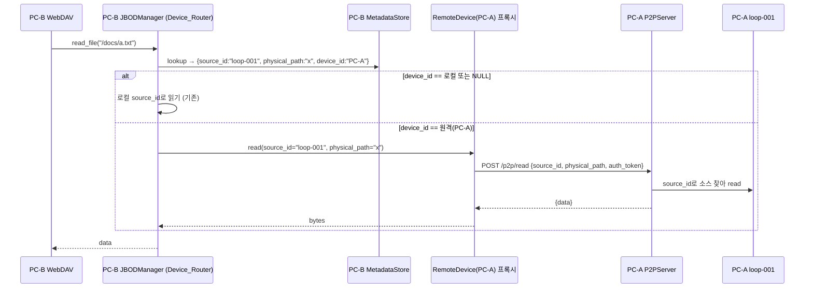

# Design: 크로스 디바이스 파일 자동 라우팅

## Overview

파일 레코드의 `device_id`를 라우팅 키로 사용하여, JBODManager.read_file이 "로컬 소유 파일이면 로컬 소스에서, 원격 소유 파일이면 그 디바이스의 P2P 서버에서" 데이터를 읽도록 한다. 핵심 변경은 세 곳이다.

1. JBODManager: read_file에 device_id 기반 분기 추가 (Device_Router 역할)
2. P2PServer: source_id로 다중 소스 노출 (sources[0] 고정 제거)
3. RemoteSource → 디바이스 단위 프록시: P2P 요청에 source_id 포함

읽기 전용으로 범위를 한정한다. 쓰기/삭제 원격 처리는 하지 않는다(데이터 소유권 보존, 삭제는 기존 tombstone).

## Architecture



## Components and Interfaces

### 1. JBODManager: Device_Router (read_file 분기)

현재 read_file은 `source_id`로 로컬 소스만 찾는다. device_id 분기를 추가한다.

```python
class JBODManager:
    def __init__(self, sources, metadata_store, encryption_engine=None,
                 device_id=None):
        ...
        # device_id → 원격 디바이스 프록시 (자동 마운트 시 등록)
        self._remote_devices: dict[str, RemoteDevice] = {}

    def register_remote_device(self, device_id: str, remote: "RemoteDevice") -> None:
        """원격 디바이스 프록시를 device_id로 등록한다."""
        self._remote_devices[device_id] = remote

    def read_file(self, virtual_path: str) -> bytes:
        metadata = self.metadata_store.lookup(virtual_path)
        if metadata is None:
            raise FileNotFoundError(...)

        owner = metadata.device_id
        # 로컬 소유 또는 레거시(NULL) → 기존 로컬 읽기
        if owner is None or owner == self.device_id:
            return self._read_local(metadata)

        # 원격 소유 → 디바이스 프록시로 라우팅
        remote = self._remote_devices.get(owner)
        if remote is None or not remote.is_active:
            raise OSError(f"원격 디바이스 미마운트/오프라인: {owner}")
        encrypted = remote.read(metadata.source_id, metadata.physical_path)
        if self.encryption_engine is not None:
            return self.encryption_engine.decrypt(encrypted)
        return encrypted
```

`_read_local`은 기존 read_file 본문(source_id로 로컬 소스 찾아 read + 복호화)을 추출한 것.

주의: 복호화는 로컬에서 수행한다. 원격에서 받은 바이트는 소유자 키로 암호화된 상태이고, 같은 계정이므로 로컬 encryption_engine의 키가 동일하다(같은 master_key). 따라서 원격 read 후 로컬 복호화가 성립한다.

### 2. RemoteDevice (디바이스 단위 프록시)

기존 RemoteSource는 "소스 하나"를 대표한다. 디바이스 단위 라우팅을 위해 RemoteDevice를 둔다. 구현은 기존 RemoteSource를 재사용하되 read에 source_id를 받도록 확장하거나, 얇은 래퍼를 추가한다.

```python
class RemoteDevice:
    """원격 디바이스의 여러 소스에 (source_id, physical_path)로 접근."""
    def __init__(self, device_id, auth_client, server_url, timeout=10.0):
        ...
    def initialize(self): ...        # routing으로 주소 확보, 활성화
    @property
    def is_active(self) -> bool: ...
    def read(self, source_id: str, physical_path: str) -> bytes:
        """POST /p2p/read {source_id, physical_path, auth_token}"""
```

설계 선택: 기존 RemoteSource에 이미 read(physical_path)가 있으므로, RemoteSource.read 시그니처를 `read(physical_path, source_id=None)`로 확장하고 P2P 요청 body에 source_id를 추가하는 방식이 변경 최소. RemoteDevice는 RemoteSource를 device 관점으로 쓰는 별칭/래퍼로 둔다. (StorageSource ABC 호환을 위해 RemoteSource는 그대로 두고, JBODManager가 device_id로 RemoteSource 인스턴스를 보유)

구현 단순화: 자동 마운트(_mount_remote_sources)가 이미 device당 RemoteSource 하나를 만든다. 그 RemoteSource를 `register_remote_device(device_id, source)`로도 등록하고, read 시 source_id를 전달하면 된다.

### 3. P2PServer: source_id 기반 다중 소스

현재 핸들러는 `self._jbod_manager.sources[0]`만 쓴다. body의 source_id로 소스를 선택한다.

```python
def _select_source(self, body) -> StorageSource | web.Response:
    source_id = body.get("source_id")
    if source_id:
        src = self._jbod_manager._get_source_by_id(source_id)
        if src is None:
            return web.json_response({"error": "Source not found"}, status=404)
        return src
    # 구버전 호환: source_id 없으면 첫 소스
    if self._jbod_manager.sources:
        return self._jbod_manager.sources[0]
    return web.json_response({"error": "No source"}, status=404)
```

`handle_read`/`handle_exists`/`handle_list`가 `_select_source`로 소스를 고르고, path traversal 검증(`_validate_path`)도 선택된 소스 루트 기준으로 수행하도록 일반화한다. `_validate_path(physical_path, source_root)`로 source_root 파라미터를 받게 변경.

### 4. 자동 마운트 통합 (stardustfs.py)

`_mount_remote_sources`가 RemoteSource를 만들 때, JBODManager에 `register_remote_device(device_id, source)`도 호출한다. 이로써 read_file 라우팅이 동작한다.

## Data Models

새 영속 데이터 없음. 기존 files.device_id 컬럼을 라우팅 키로 활용한다.
P2P 요청 body 확장: `{"physical_path": ..., "source_id": ..., "auth_token": ...}` (source_id 추가, 선택적).

## Correctness Properties

### Property 1: 읽기 라우팅 결정성

*임의의* 파일 레코드(device_id, source_id)와 로컬 device_id에 대해, read_file의 라우팅 결정은 다음과 정확히 일치해야 한다:
- device_id가 NULL 또는 로컬과 같으면 → 로컬 읽기
- device_id가 원격이고 프록시가 활성이면 → 원격 읽기
- device_id가 원격이고 프록시가 없거나 비활성이면 → OSError

이 분기는 상호 배타적이며 모든 경우를 커버한다.

**Validates: Requirements 1.2, 1.3, 1.4, 1.5, 3.4**

### Property 2: P2P 소스 선택 정합성

*임의의* source_id에 대해, P2P 서버는 (1) 그 source_id의 소스가 존재하면 그 소스에서 읽고, (2) 없으면 404, (3) source_id가 비면 첫 소스를 쓴다. path traversal 검증은 항상 선택된 소스 루트 기준으로 적용된다.

**Validates: Requirements 2.1, 2.2, 2.3, 2.4**

## Error Handling

| 상황 | 동작 |
|------|------|
| 원격 device 미마운트 | OSError → WebDAV 503/404 |
| 원격 device 오프라인 | OSError → WebDAV 503 |
| P2P 타임아웃/4xx/5xx | OSError |
| source_id 미존재(P2P) | 404 |
| 원격 파일에 write | OSError (읽기 전용) |
| device_id NULL(레거시) | 로컬 읽기 (호환) |

## Testing Strategy

- 단위: read_file 라우팅 분기(로컬/레거시/원격활성/원격비활성/프록시없음), P2P _select_source(존재/미존재/빈값)
- Property: Property 1(라우팅 결정성), Property 2(소스 선택)
- 통합: PC-A가 loop-001에 파일 저장 → metadata 동기화 → PC-B에서 read_file이 원격 라우팅으로 동일 바이트 수신 (mock 중앙 서버 + 실제 P2PServer)
- 회귀: 기존 test_p2p_integration, test_jbod_manager 보존
