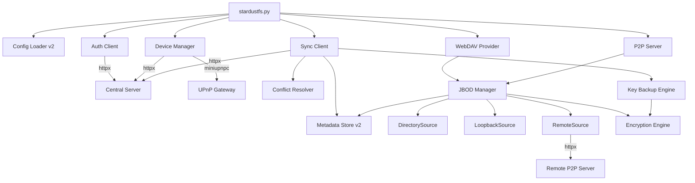
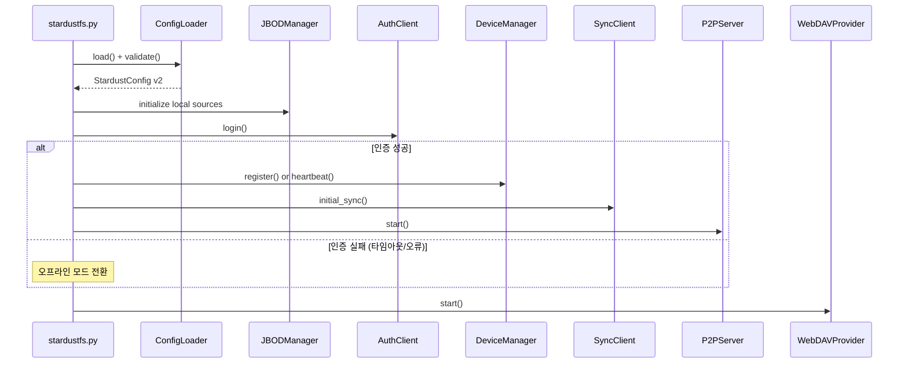
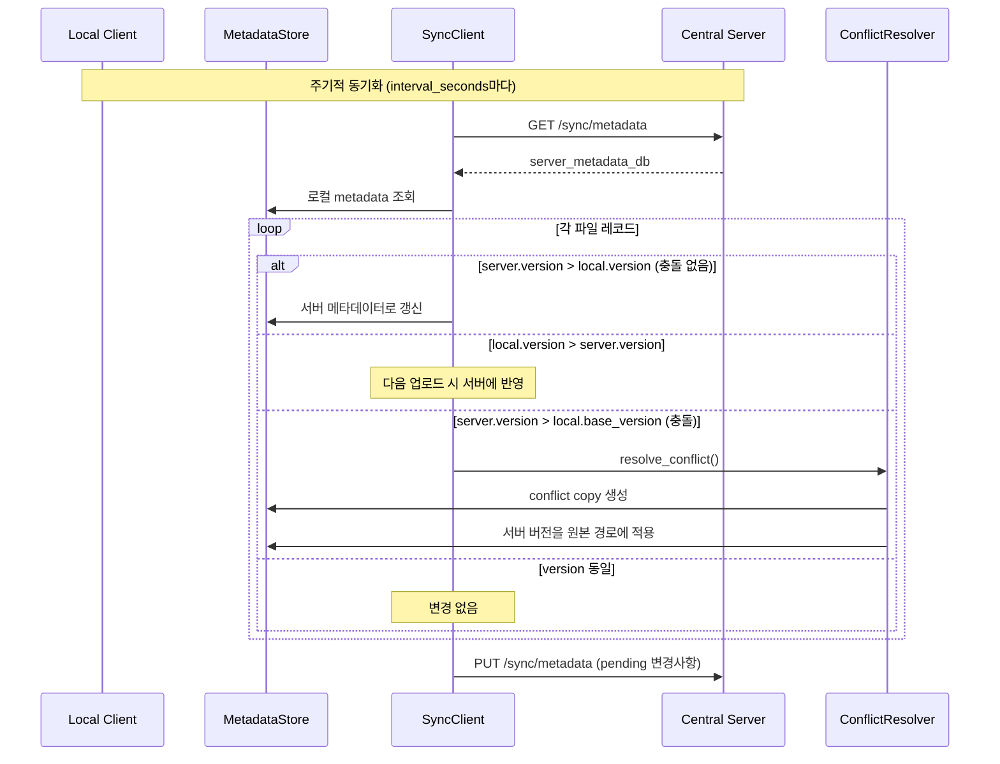
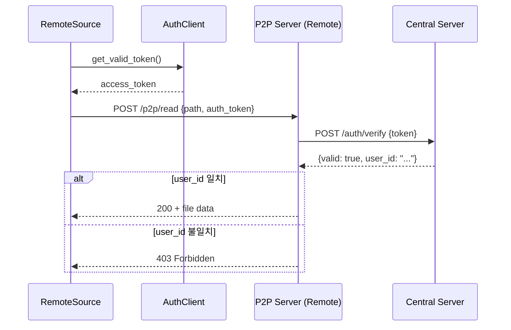

# Technical Design Document

## Overview

StardustFS MVP2 클라이언트 멀티디바이스 확장의 기술 설계 문서이다. 기존 단일 디바이스 WebDAV 클라이언트에 중앙 서버 인증, 메타데이터 동기화, P2P 파일 전송, Key 백업/복원 기능을 추가한다.

핵심 아키텍처 원칙:
- 중앙 서버는 인증/라우팅/메타데이터 백업만 담당, 파일 데이터는 PC 간 P2P 직접 전송
- 오프라인 우선(offline-first): 서버 연결 불가 시에도 로컬 기능 정상 동작
- 기존 MVP1 코드와의 하위 호환성 유지 (StorageSource ABC, MetadataStore 확장)
- 비동기 I/O 기반 네트워크 통신 (httpx, aiohttp)

```
┌─────────────────────────────────────────────────────────────────┐
│                        StardustFS Client                         │
├─────────────────────────────────────────────────────────────────┤
│  ┌──────────┐  ┌──────────────┐  ┌──────────────┐             │
│  │ WebDAV   │  │ P2P Server   │  │ Device Mgr   │             │
│  │ Provider │  │ (aiohttp)    │  │ (heartbeat)  │             │
│  └────┬─────┘  └──────┬───────┘  └──────┬───────┘             │
│       │                │                  │                     │
│  ┌────┴────────────────┴──────────────────┴───────┐            │
│  │              JBOD Manager                       │            │
│  ├─────────────────────────────────────────────────┤            │
│  │ DirectorySource │ LoopbackSource │ RemoteSource │            │
│  └─────────────────┴───────────────┴──────────────┘            │
│                                                                  │
│  ┌──────────────┐  ┌──────────────┐  ┌────────────────┐       │
│  │ Auth Client  │  │ Sync Client  │  │ Key Backup Eng │       │
│  └──────┬───────┘  └──────┬───────┘  └────────┬───────┘       │
│         │                  │                    │                │
│         └──────────────────┼────────────────────┘                │
│                            │                                     │
└────────────────────────────┼─────────────────────────────────────┘
                             │ HTTPS
                    ┌────────┴────────┐
                    │  Central Server  │
                    │  (FastAPI)       │
                    └─────────────────┘
```

## Architecture

### High-Level Architecture

시스템은 3개의 주요 계층으로 구성된다:

1. **Presentation Layer**: WebDAV Provider (wsgidav) — 사용자에게 파일시스템 인터페이스 제공
2. **Business Logic Layer**: JBOD Manager, Sync Client, Conflict Resolver — 파일 관리 및 동기화 로직
3. **Infrastructure Layer**: Storage Sources (Local/Remote), Auth Client, P2P Server — 물리적 I/O 및 네트워크 통신

### 모듈 의존성 그래프



### 초기화 순서 (Startup Sequence)



### Low-Level Design: 동기화 흐름



## Components and Interfaces

### 1. AuthClient (`stardustlib/auth_client.py`)

중앙 서버 인증 API를 호출하여 JWT 토큰 라이프사이클을 관리한다.

```python
class AuthClient:
    """중앙 서버 인증 클라이언트."""

    def __init__(self, server_url: str, timeout: float = 10.0) -> None: ...

    async def login(self, email: str, password: str) -> None:
        """로그인하여 토큰 쌍을 메모리에 저장."""
        ...

    async def refresh_token(self) -> None:
        """access_token 갱신. 실패 시 토큰 삭제."""
        ...

    async def get_valid_token(self) -> str:
        """유효한 access_token 반환. 만료 임박 시 자동 갱신."""
        ...

    @property
    def is_authenticated(self) -> bool: ...

    @property
    def is_offline(self) -> bool: ...

    @property
    def user_id(self) -> str | None: ...
```

내부 상태:
- `_access_token: str | None`
- `_refresh_token: str | None`
- `_token_expires_at: float` (UTC timestamp)
- `_offline: bool`

### 2. DeviceManager (`stardustlib/device_manager.py`)

디바이스 등록, heartbeat 전송, UPnP NAT 트래버설을 관리한다.

```python
class DeviceManager:
    """디바이스 등록 및 heartbeat 관리."""

    def __init__(
        self,
        auth_client: AuthClient,
        server_url: str,
        device_name: str,
        p2p_port: int,
    ) -> None: ...

    async def register(self) -> str:
        """디바이스 등록. device_id 반환."""
        ...

    async def start_heartbeat(self) -> None:
        """백그라운드 heartbeat 루프 시작."""
        ...

    async def stop(self) -> None:
        """heartbeat 중지 + UPnP 매핑 해제."""
        ...

    def get_connection_address(self) -> str:
        """현재 P2P 접속 주소 (IP:port) 반환."""
        ...

    @property
    def device_id(self) -> str | None: ...
```

### 3. SyncClient (`stardustlib/sync_client.py`)

메타데이터 동기화 및 Key 백업/복원 API 호출을 담당한다.

```python
class SyncClient:
    """메타데이터/키 동기화 클라이언트."""

    def __init__(
        self,
        auth_client: AuthClient,
        server_url: str,
        metadata_store: MetadataStore,
        conflict_resolver: ConflictResolver,
        interval_seconds: int = 30,
    ) -> None: ...

    async def initial_sync(self) -> None:
        """시작 시 서버에서 metadata_db 다운로드 및 병합."""
        ...

    async def start_periodic_sync(self) -> None:
        """주기적 동기화 루프 시작."""
        ...

    async def upload_metadata(self) -> None:
        """로컬 metadata_db 스냅샷을 서버에 업로드."""
        ...

    async def upload_key(self, encrypted_blob: bytes) -> None:
        """암호화된 key blob을 서버에 업로드."""
        ...

    async def download_key(self) -> bytes:
        """서버에서 암호화된 key blob 다운로드."""
        ...

    async def stop(self) -> None:
        """동기화 루프 중지."""
        ...
```

### 4. ConflictResolver (`stardustlib/conflict_resolver.py`)

메타데이터 병합 시 충돌을 감지하고 conflict copy를 생성한다.

```python
class ConflictResolver:
    """메타데이터 충돌 감지 및 해결."""

    def __init__(
        self,
        metadata_store: MetadataStore,
        device_name: str,
    ) -> None: ...

    def detect_conflict(
        self,
        virtual_path: str,
        server_version: int,
        local_version: int,
        local_base_version: int,
    ) -> bool:
        """충돌 여부 판정."""
        ...

    def resolve_conflict(
        self,
        virtual_path: str,
        server_version: int,
    ) -> str:
        """conflict copy 생성. 새 파일명 반환."""
        ...

    def generate_conflict_name(
        self,
        virtual_path: str,
    ) -> str:
        """충돌 파일명 생성: '{name} (conflict - {device} - {timestamp}).{ext}'"""
        ...
```

### 5. RemoteSource (`stardustlib/remote_source.py`)

다른 PC의 스토리지를 StorageSource 인터페이스로 래핑한다.

```python
class RemoteSource(StorageSource):
    """원격 디바이스의 스토리지에 접근하는 소스."""

    def __init__(
        self,
        source_id: str,
        device_id: str,
        auth_client: AuthClient,
        server_url: str,
        timeout: float = 10.0,
    ) -> None: ...

    def initialize(self) -> None:
        """Central Server에서 대상 디바이스 접속 주소 조회 후 활성화."""
        ...

    def read(self, physical_path: str) -> bytes:
        """P2P POST /p2p/read 요청."""
        ...

    def write(self, physical_path: str, data: bytes) -> None:
        """P2P POST /p2p/write 요청."""
        ...

    def delete(self, physical_path: str) -> None:
        """P2P POST /p2p/delete 요청."""
        ...

    # ... 나머지 StorageSource 메서드 구현
```

### 6. P2PServer (`stardustlib/p2p_server.py`)

다른 디바이스의 파일 요청을 처리하는 경량 HTTP 서버이다.

```python
class P2PServer:
    """aiohttp 기반 P2P 파일 서버."""

    def __init__(
        self,
        jbod_manager: JBODManager,
        auth_client: AuthClient,
        port: int,
        server_url: str,
    ) -> None: ...

    async def start(self) -> None:
        """서버 시작."""
        ...

    async def stop(self) -> None:
        """서버 중지."""
        ...

    async def handle_read(self, request: web.Request) -> web.Response: ...
    async def handle_write(self, request: web.Request) -> web.Response: ...
    async def handle_delete(self, request: web.Request) -> web.Response: ...
    async def handle_list(self, request: web.Request) -> web.Response: ...
```

P2P 요청/응답 형식:
```json
// POST /p2p/read 요청
{"physical_path": "dir/file.enc", "auth_token": "eyJ..."}

// POST /p2p/write 요청
{"physical_path": "dir/file.enc", "data": "<base64>", "auth_token": "eyJ..."}

// POST /p2p/list 응답
{"entries": ["file1.enc", "file2.enc", "subdir"]}
```

### 7. KeyBackupEngine (`stardustlib/key_backup_engine.py`)

master_key를 사용자 비밀번호로 2차 암호화하여 백업 blob을 생성/복원한다.

```python
class KeyBackupEngine:
    """Key 백업/복원 엔진."""

    PBKDF2_ITERATIONS: int = 600_000
    SALT_SIZE: int = 16
    IV_SIZE: int = 12
    TAG_SIZE: int = 16

    def encrypt_for_backup(self, master_key: bytes, password: str) -> bytes:
        """master_key를 비밀번호로 암호화. blob = salt + iv + tag + ciphertext."""
        ...

    def decrypt_from_backup(self, blob: bytes, password: str) -> bytes:
        """blob을 비밀번호로 복호화하여 master_key 복원."""
        ...
```

### 8. ConfigLoader v2 확장

기존 ConfigLoader에 v2 설정 파싱/검증 및 v1→v2 마이그레이션 로직을 추가한다.

```python
# 추가되는 설정 타입
class ServerConfig(TypedDict):
    url: str | None
    device_name: str

class SyncConfig(TypedDict):
    interval_seconds: int
    conflict_strategy: Literal["copy"]

class P2PConfig(TypedDict):
    port: int
    enabled: bool

class RemoteSourceConfig(TypedDict):
    type: Literal["remote"]
    id: str
    device_id: str  # RFC 4122 UUID

class StardustConfigV2(TypedDict):
    version: Literal[2]
    server: ServerConfig
    webdav: WebDAVConfig
    sources: list[SourceConfig | RemoteSourceConfig]
    sync: SyncConfig
    p2p: P2PConfig
    metadata_db: str
    key_file: str | None
```

## Data Models

### MetadataStore v2 스키마 확장

기존 `files` 테이블에 동기화 관련 컬럼을 추가한다:

```sql
-- 기존 files 테이블에 추가되는 컬럼
ALTER TABLE files ADD COLUMN version INTEGER NOT NULL DEFAULT 1;
ALTER TABLE files ADD COLUMN device_id TEXT;
ALTER TABLE files ADD COLUMN sync_status TEXT DEFAULT 'synced';
-- sync_status: 'synced' | 'pending' | 'conflict'

-- 스키마 버전 추적 테이블
CREATE TABLE IF NOT EXISTS schema_version (
    id INTEGER PRIMARY KEY CHECK (id = 1),
    version INTEGER NOT NULL,
    migrated_at REAL NOT NULL
);
```

### 설정 파일 v2 구조

```json
{
  "version": 2,
  "server": {
    "url": "https://api.stardustfs.io",
    "device_name": "my-desktop"
  },
  "webdav": {
    "host": "127.0.0.1",
    "port": 8080,
    "username": "user",
    "password": "pass"
  },
  "sources": [
    {"type": "directory", "id": "vol1", "path": "/data/vol1"},
    {"type": "loopback", "id": "vol2", "path": "/data/vol2.img", "size": 1073741824},
    {"type": "remote", "id": "laptop-src", "device_id": "550e8400-e29b-41d4-a716-446655440000"}
  ],
  "sync": {
    "interval_seconds": 30,
    "conflict_strategy": "copy"
  },
  "p2p": {
    "port": 9090,
    "enabled": true
  },
  "metadata_db": "/path/to/metadata.db",
  "key_file": "/path/to/master.key"
}
```

### Key Backup Blob 형식

```
┌──────────┬──────────┬──────────┬──────────────┐
│ salt     │ iv       │ tag      │ ciphertext   │
│ (16 B)   │ (12 B)   │ (16 B)   │ (32 B)       │
└──────────┴──────────┴──────────┴──────────────┘
Total: 76 bytes (master_key가 32바이트일 때)
```

- salt: PBKDF2용 랜덤 솔트 (16바이트)
- iv: AES-256-GCM 초기화 벡터 (12바이트)
- tag: GCM 인증 태그 (16바이트)
- ciphertext: 암호화된 master_key (32바이트)

### P2P 요청 인증 흐름




## Correctness Properties

*속성(property)이란 시스템의 모든 유효한 실행에서 참이어야 하는 특성 또는 동작을 의미한다. 본질적으로 시스템이 무엇을 해야 하는지에 대한 형식적 진술이다. 속성은 사람이 읽을 수 있는 명세와 기계가 검증 가능한 정확성 보장 사이의 다리 역할을 한다.*

### Property 1: v2 설정 검증 일관성

*임의의* v2 설정 딕셔너리에서, 각 필드가 유효 범위 내에 있으면 해당 필드에 대한 검증 에러가 발생하지 않아야 하고, 유효 범위 밖에 있으면 해당 필드를 식별하는 검증 에러가 반드시 포함되어야 한다. 구체적으로:
- server.url이 "https://"로 시작하고 호스트명을 포함하면 url 관련 에러 없음
- server.device_name이 1-64자이면 device_name 관련 에러 없음
- sync.interval_seconds가 10-3600이면 interval 관련 에러 없음
- p2p.port가 1024-65535이면 port 관련 에러 없음
- remote source의 device_id가 RFC 4122 UUID 형식이면 device_id 관련 에러 없음

**Validates: Requirements 2.3, 2.4, 2.5, 2.7, 2.9, 2.11**

### Property 2: v1→v2 마이그레이션 필드 보존

*임의의* 유효한 v1 설정 파일에 대해, v2로 마이그레이션한 결과는 (1) version이 2이고, (2) 원본의 webdav, sources, metadata_db, key_file 필드가 바이트 단위로 동일하게 보존되며, (3) server, sync, p2p 섹션이 기본값으로 추가되어야 한다.

**Validates: Requirements 13.1, 13.2, 13.3, 13.4, 13.5, 13.6**

### Property 3: 메타데이터 병합 정확성

*임의의* 서버 메타데이터 레코드와 로컬 메타데이터 레코드 쌍에 대해:
- server_version > local_base_version이면 충돌로 판정
- 충돌이 아니고 server_version > local_version이면 서버 메타데이터로 갱신
- 충돌이 아니고 local_version > server_version이면 로컬 유지 (업로드 대상)
- server_version == local_version이면 변경 없음

이 네 가지 경우는 상호 배타적이며 모든 가능한 version 조합을 커버해야 한다.

**Validates: Requirements 5.1, 5.5, 5.6, 5.7**

### Property 4: 충돌 파일명 형식 및 고유성

*임의의* 가상 경로와 디바이스 이름에 대해, 생성된 conflict 파일명은 (1) "{원본이름} (conflict - {device_name} - {YYYY-MM-DD HH-MM-SS}).{확장자}" 형식을 준수하고, (2) 동일 파일명이 이미 존재하는 경우 순번 "(2)", "(3)" 등을 추가하여 항상 고유한 파일명을 반환해야 한다.

**Validates: Requirements 5.2, 5.8**

### Property 5: Key 백업 라운드트립

*임의의* 유효한 32바이트 master_key와 8자 이상의 비밀번호 조합에 대해, encrypt_for_backup 후 동일 비밀번호로 decrypt_from_backup을 수행하면 원본 master_key와 바이트 단위로 동일한 결과를 반환해야 한다.

**Validates: Requirements 6.7**

### Property 6: 잘못된 비밀번호로 복호화 실패

*임의의* 유효한 32바이트 master_key, 올바른 비밀번호, 그리고 올바른 비밀번호와 다른 잘못된 비밀번호에 대해, encrypt_for_backup(master_key, correct_password)로 생성된 blob을 decrypt_from_backup(blob, wrong_password)로 복호화하면 IntegrityError가 발생해야 한다.

**Validates: Requirements 6.6**

### Property 7: Path Traversal 방지

*임의의* physical_path 문자열이 ".." 세그먼트를 포함하거나 정규화 후 소스 루트 경로 외부를 참조하면, P2P Server는 해당 요청을 거부하고 400 Bad Request를 반환해야 한다. 소스 루트 내부의 유효한 경로에 대해서는 거부하지 않아야 한다.

**Validates: Requirements 8.11**

### Property 8: 백업 파일명 고유성

*임의의* 원본 설정 파일 경로와 기존 백업 파일 집합에 대해, 마이그레이션 시 생성되는 백업 파일명은 기존 파일과 충돌하지 않는 고유한 이름이어야 한다. 기존 ".v1.bak"이 없으면 "{원본}.v1.bak"을, 이미 존재하면 "{원본}.v1.bak.{N}" (N은 최소 미사용 순번)을 사용해야 한다.

**Validates: Requirements 13.9**


## Error Handling

### 에러 계층 구조

기존 `stardustlib/exceptions.py`에 MVP2 관련 예외를 추가한다:

```python
# 기존 예외 (유지)
class StardustError(Exception): ...
class DecryptionError(StardustError): ...
class IntegrityError(StardustError): ...
class InvalidKeyError(StardustError): ...
class KeyNotFoundError(StardustError): ...
class InsufficientStorageError(StardustError): ...

# MVP2 추가 예외
class AuthenticationError(StardustError):
    """인증 실패 (잘못된 자격 증명, 토큰 만료 등)."""
    pass

class SyncError(StardustError):
    """메타데이터 동기화 실패."""
    pass

class DeviceRegistrationError(StardustError):
    """디바이스 등록 실패."""
    pass

class P2PConnectionError(StardustError):
    """P2P 연결 실패."""
    pass

class ConfigMigrationError(StardustError):
    """설정 파일 마이그레이션 실패."""
    pass
```

### 에러 처리 전략

| 모듈 | 에러 상황 | 처리 방식 |
|------|----------|----------|
| AuthClient | 서버 401 응답 | AuthenticationError 발생 |
| AuthClient | 네트워크 타임아웃 (10초) | 오프라인 모드 전환, 로그 기록 |
| AuthClient | refresh 실패 | 토큰 삭제, 재로그인 필요 로그 |
| DeviceManager | 등록 실패 (5회 재시도 후) | 오프라인 모드 전환, 로그 기록 |
| DeviceManager | heartbeat 3회 연속 실패 | 재시도 간격 120초로 증가 |
| SyncClient | 메타데이터 업로드 실패 | sync_status "pending" 유지, 다음 주기 재시도 |
| SyncClient | 메타데이터 다운로드 실패 | 로컬 DB 사용, 오프라인 모드 |
| ConflictResolver | conflict copy 생성 중 FS 오류 | sync_status "pending" 유지, 로그 기록 |
| KeyBackupEngine | 복호화 실패 | IntegrityError 발생 |
| SyncClient | key blob 미존재 | KeyNotFoundError 발생 |
| RemoteSource | P2P 타임아웃 (10초) | OSError 발생 |
| RemoteSource | P2P 4xx/5xx 응답 | OSError (상태 코드 포함) |
| P2PServer | path traversal 감지 | 400 Bad Request |
| P2PServer | 인증 실패 | 401 Unauthorised |
| P2PServer | user_id 불일치 | 403 Forbidden |
| P2PServer | 파일 미존재 | 404 Not Found |
| P2PServer | payload > 100MB | 413 Payload Too Large |
| ConfigLoader | 마이그레이션 백업 실패 | 마이그레이션 중단, 원본 보존 |

### 재시도 정책

| 작업 | 최대 재시도 | 간격 | 실패 시 |
|------|-----------|------|---------|
| 디바이스 등록 | 5회 | 10초 | 오프라인 모드 |
| Heartbeat | 무제한 (간격 증가) | 60초→120초 | 로그 기록 |
| 메타데이터 업로드 | 3회 | interval_seconds | 로그 기록 |
| Key 업로드/다운로드 | 3회 | 즉시 재시도 | 예외 발생 |
| P2P 토큰 갱신 후 재시도 | 1회 | 즉시 | 오류 반환 |


## Testing Strategy

### 테스트 프레임워크

- **Unit/Integration**: pytest + pytest-asyncio
- **Property-Based Testing**: hypothesis (Python PBT 라이브러리)
- **Mocking**: unittest.mock, pytest-httpx (httpx mock), aioresponses (aiohttp mock)

### 이중 테스트 접근법

1. **Property Tests** (hypothesis): 정확성 속성을 100+ 반복으로 검증
2. **Unit Tests** (pytest): 특정 시나리오, 에지 케이스, 에러 조건 검증
3. **Integration Tests** (pytest): 모듈 간 상호작용, Mock 서버 기반 E2E 흐름

### Property Test 구성

각 property test는 최소 100회 반복으로 실행하며, 설계 문서의 property를 참조한다.

```python
from hypothesis import given, settings, strategies as st

@settings(max_examples=100)
@given(...)
def test_property_name(...):
    """Feature: mvp2-client-multidevice, Property N: {property_text}"""
    ...
```

### 테스트 대상별 전략

| 모듈 | Property Test | Unit Test | Integration Test |
|------|:---:|:---:|:---:|
| ConfigLoader v2 (검증) | ✓ (Property 1) | ✓ | - |
| ConfigLoader v2 (마이그레이션) | ✓ (Property 2, 8) | ✓ | - |
| ConflictResolver (병합) | ✓ (Property 3) | ✓ | - |
| ConflictResolver (파일명) | ✓ (Property 4) | ✓ | - |
| KeyBackupEngine | ✓ (Property 5, 6) | ✓ | - |
| P2PServer (path 검증) | ✓ (Property 7) | ✓ | - |
| AuthClient | - | ✓ | ✓ |
| DeviceManager | - | ✓ | ✓ |
| SyncClient | - | ✓ | ✓ |
| RemoteSource | - | ✓ | ✓ |
| P2PServer (전체) | - | ✓ | ✓ |
| MetadataStore v2 | - | ✓ | - |
| WebDAV Placeholder | - | ✓ | - |

### Unit Test 주요 시나리오

- AuthClient: 로그인 성공/실패, 토큰 갱신, 오프라인 전환
- DeviceManager: 등록 성공/재시도/실패, heartbeat 간격 변경
- SyncClient: 초기 동기화, 주기적 업로드, 오프라인→온라인 복구
- RemoteSource: 각 StorageSource 메서드의 성공/실패/타임아웃
- P2PServer: 각 엔드포인트의 정상/인증실패/파일미존재/payload초과
- MetadataStore: 스키마 마이그레이션, version 증가, sync_status 변경
- WebDAV Placeholder: 오프라인 파일 표시, 503 응답, 온라인 복구

### 테스트 디렉토리 구조

```
tests/
├── test_auth_client.py
├── test_config_loader_v2.py
├── test_conflict_resolver.py
├── test_device_manager.py
├── test_key_backup_engine.py
├── test_metadata_store_v2.py
├── test_p2p_server.py
├── test_remote_source.py
├── test_sync_client.py
├── test_webdav_placeholder.py
└── properties/
    ├── test_prop_config_validation.py
    ├── test_prop_config_migration.py
    ├── test_prop_conflict_resolver.py
    ├── test_prop_key_backup.py
    └── test_prop_path_traversal.py
```

