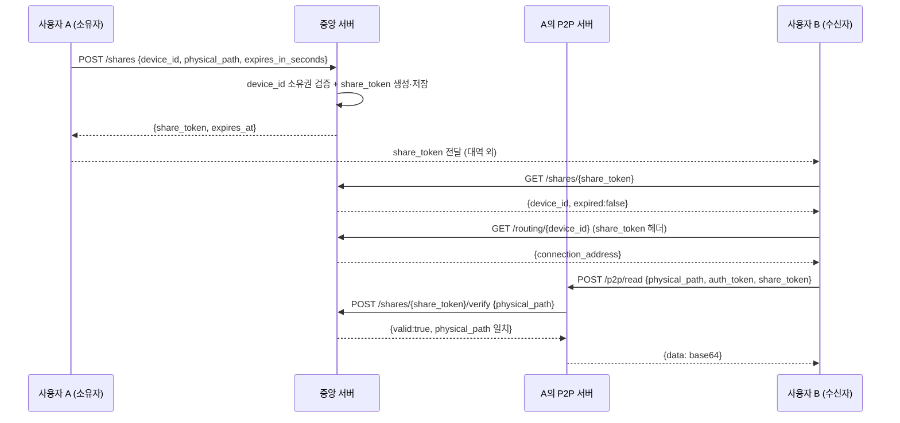

# Design: MVP5 파일 공유 데모 (최소 슬라이스)

## Overview

기존 MVP2의 P2P 인프라(P2PServer, RemoteSource, /auth/verify, /routing) 위에 "교차 사용자 읽기 전용 공유" 레이어를 최소한으로 얹는다. 핵심은 두 가지다.

1. 중앙 서버가 공유 토큰을 발급·검증한다 (shares 테이블 + 3개 엔드포인트).
2. P2PServer가 요청에 share_token이 있으면 user_id 일치 검증 대신 중앙 서버에 토큰 검증을 위임하고, 토큰에 묶인 경로에 한해 읽기를 허용한다.

데이터는 변경하지 않는다(읽기 전용). 소유자 파일은 소유자 키로 암호화되어 있으므로, 수신자가 평문을 보려면 소유자가 키도 별도로 전달해야 한다. 본 데모는 "암호화된 바이트의 P2P 전달과 인가"까지를 검증 범위로 하며, 키 공유는 범위 밖이다(수신자는 RemoteSource로 받은 raw 바이트의 동일성으로 검증).

## Architecture



## Components and Interfaces

### 1. 중앙 서버: shares 테이블 (신규)

```sql
CREATE TABLE IF NOT EXISTS shares (
    token TEXT PRIMARY KEY,                 -- secrets.token_urlsafe(32)
    owner_user_id TEXT NOT NULL REFERENCES users(id) ON DELETE CASCADE,
    device_id TEXT NOT NULL,
    physical_path TEXT NOT NULL,
    created_at TEXT NOT NULL DEFAULT (datetime('now')),
    expires_at TEXT NOT NULL
);
CREATE INDEX IF NOT EXISTS idx_shares_owner ON shares(owner_user_id);
```

### 2. 중앙 서버: ShareService

```python
class ShareService:
    async def create_share(self, owner_user_id, device_id, physical_path,
                           expires_in_seconds) -> dict:
        """device_id 소유권 검증 후 share_token 생성. {token, expires_at} 반환."""

    async def get_share(self, token) -> dict:
        """토큰 조회. 없으면 BackupNotFoundError류(404), 만료면 ShareExpiredError(410).
        반환: {device_id, expired:false}. physical_path는 노출 안 함."""

    async def verify_share(self, token, physical_path) -> dict:
        """P2P 서버의 위임 검증용. 토큰 유효(존재·미만료)하고
        physical_path가 토큰에 묶인 경로와 일치하면 {valid:true}. 아니면 valid:false."""
```

### 3. 중앙 서버: 라우터 (신규 /shares)

```python
POST /shares                      # 발급 (인증 필요, 소유자)
GET  /shares/{token}              # 조회 (인증 필요, 수신자)
POST /shares/{token}/verify       # P2P 서버의 위임 검증 (physical_path 일치 확인)
```

GET /routing/{device_id}는 기존 라우터를 확장한다: `X-Share-Token` 헤더가 있고 그 토큰이 유효하며 토큰의 device_id와 경로 파라미터가 일치하면, 소유권 검증(DeviceAccessDeniedError)을 우회하여 라우팅 정보를 반환한다.

### 4. 클라이언트: P2PServer 인가 확장

`_parse_and_verify`를 확장한다. 요청 body에 `share_token`이 있으면:
1. user_id 일치 검증을 건너뛴다.
2. 중앙 서버 `POST /shares/{token}/verify`에 요청 body의 physical_path를 보내 검증.
3. valid가 아니면 401, physical_path 불일치면 403.
4. 검증 통과 시 read만 허용(write/delete 핸들러는 share_token 경로를 받지 않음).

기존 path traversal 검증(`_validate_path`)은 그대로 적용된다.

### 5. 클라이언트: RemoteSource 공유 읽기 (데모용 헬퍼)

데모/테스트에서 수신자가 share_token으로 읽을 수 있도록, RemoteSource에 share_token을 실어 /p2p/read를 호출하는 경로를 추가한다. 본 슬라이스에서는 별도 ShareClient를 만들지 않고 통합 테스트에서 직접 httpx로 흐름을 구동해도 무방하다(데모 목적).

## Data Models

```python
class ShareCreateRequest(BaseModel):
    device_id: str
    physical_path: str
    expires_in_seconds: int = Field(ge=1, le=2_592_000)  # 1초 ~ 30일

class ShareCreateResponse(BaseModel):
    share_token: str
    expires_at: datetime

class ShareInfoResponse(BaseModel):
    device_id: str
    expired: bool

class ShareVerifyRequest(BaseModel):
    physical_path: str

class ShareVerifyResponse(BaseModel):
    valid: bool
```

## Correctness Properties

### Property 1: 공유 토큰 경로 격리

*임의의* share_token과 임의의 physical_path 요청에 대해, P2P 서버는 요청 경로가 토큰에 묶인 경로와 정확히 일치할 때만 읽기를 허용하고, 그 외의 모든 경로는 거부해야 한다. 즉 토큰 하나로 묶인 경로 외의 파일에는 절대 접근할 수 없다.

**Validates: Requirements 3.3**

### Property 2: 만료 단조성

*임의의* share_token에 대해, 현재 시각이 expires_at 이전이면 verify는 valid=true(경로 일치 시), 이후이면 항상 valid=false여야 한다. 한번 만료된 토큰은 다시 유효해지지 않는다.

**Validates: Requirements 2.3, 3.4**

## Error Handling

| 컴포넌트 | 상황 | 동작 |
|---------|------|------|
| ShareService.create_share | device_id 소유 아님 | 403 DeviceAccessDenied |
| ShareService.create_share | expires_in_seconds 범위 밖 | 422 (pydantic 검증) |
| ShareService.get_share | 토큰 없음 | 404 |
| ShareService.get_share | 만료됨 | 410 Gone |
| P2PServer /p2p/read | share_token 무효/만료 | 401 |
| P2PServer /p2p/read | 경로 불일치 | 403 |
| P2PServer /p2p/read | path traversal | 400 (기존) |

## Testing Strategy

- 서버 단위: shares 발급/조회/만료/소유권/검증 (pytest + httpx)
- 클라이언트 통합: 사용자 A 발급 → B가 share_token으로 /p2p/read 성공, 만료 거부, 경로 격리 거부 (실제 P2PServer + mock 중앙 서버 또는 로컬 서버)
- 별도 테스트 계정 2개(A, B) 사용
